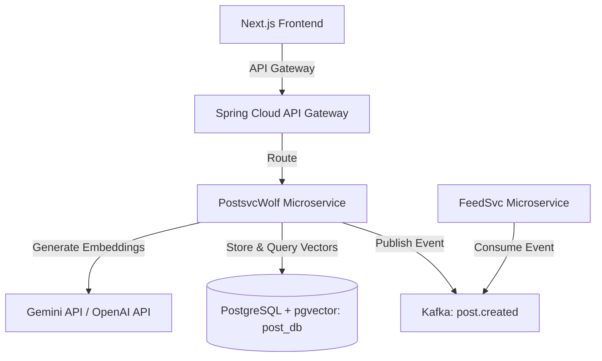

# WolfDire GenAI, Semantic Search & RAG Architecture Strategy

This document details how to integrate Generative AI, Semantic Search, and Retrieval-Augmented Generation (RAG) directly into the **WolfDire** microservices architecture. 

Yes, we can absolutely add this functionality to the current codebase! Here is how the architecture and implementation will work.

---

## 1. WolfDire GenAI Architecture

The WolfDire application uses a Spring Boot microservice backend with a PostgreSQL shared database instance (different logical databases like `post_db` and `feed_db`) and a Next.js frontend.



---

## 2. Proposed Features & Microservice Mapping

### A. Semantic Post Search (`PostsvcWolf`)
Instead of simple keyword matching, users can find posts by meaning.
- **Workflow**: 
  1. When a post is created, `PostsvcWolf` sends the title + content to an embedding model (e.g. Gemini `text-embedding-004` or OpenAI `text-embedding-3-small`).
  2. The generated vector embedding (e.g., 1536 dimensions) is stored in the `post` table in a new `embedding` column of type `vector(1536)`.
  3. When a user searches, the query is embedded, and a cosine similarity query (`<=>` operator) is run against the `post` table.
- **Endpoint**: `GET /api/posts/semantic-search?query=...`

### B. "Related Posts" Recommendations (`PostsvcWolf`)
Display similar content on the post detail page.
- **Workflow**:
  1. User views a post.
  2. Frontend requests similar posts.
  3. `PostsvcWolf` queries the database for posts closest to the current post's embedding, excluding the post itself.
- **Endpoint**: `GET /api/posts/{postId}/related`

### C. AI-Powered Discussion Summaries (`PostsvcWolf` & `CommentSvc`)
Summarize long comment sections using an LLM.
- **Workflow**:
  1. Frontend displays an "AI Summary" button on post comment sections.
  2. `PostsvcWolf` fetches comments for the post, formats them as a prompt, and calls Gemini API or OpenAI API to generate a concise summary.
- **Endpoint**: `GET /api/posts/{postId}/summary`

### D. Smart Hybrid Feed Ranking (`FeedSvc`)
Incorporate semantic preferences into the user feed.
- **Workflow**:
  1. Track user interactions (views, likes, saves) to build a "User Profile Vector" (average vector of posts they liked).
  2. Query `post_db` for posts similar to the User Profile Vector.
  3. Apply Hybrid Ranking:
     $$\text{Score} = 0.5 \times \text{semantic\_similarity} + 0.3 \times \text{engagement} + 0.2 \times \text{recency}$$

---

## 3. Technology Stack & Integration Details

We will be using the following core components for our implementation:
1. **Database Backend**: PostgreSQL + `pgvector` for storing and performing vector similarity calculations.
2. **AI SDK (Java)**: `dev.langchain4j` (already present in `FeedSvc`), keeping the entire AI and LLM logic natively in Java without needing Python.
3. **Embeddings & LLM**: OpenAI / Google Gemini API for generating 1536-dimensional semantic embeddings and text completions/summaries.
4. **Search Capabilities**: Semantic search (via cosine similarity query) and Related posts matching.
5. **RAG / AI Summary**: For summarizing post comment discussions.

### Database: PostgreSQL + `pgvector`
We will replace the base Postgres image in `docker-compose.yml` with one that has `pgvector` pre-installed:
```yaml
postgres:
  image: pgvector/pgvector:pg16
  container_name: shared-postgres
  # ... other configurations unchanged
```

### Spring Boot Integration (`PostsvcWolf`)
We can leverage **Spring AI** (specifically `spring-ai-openai-spring-boot-starter` or `spring-ai-vertex-ai-gemini-spring-boot-starter`) to handle embeddings and model calls easily.

#### Database Migration (`post_db` schema):
```sql
-- Enable the vector extension
CREATE EXTENSION IF NOT EXISTS vector;

-- Add embedding column to posts
ALTER TABLE post ADD COLUMN embedding vector(1536);

-- Create HNSW index for fast similarity search
CREATE INDEX ON post USING hnsw (embedding vector_cosine_ops);
```

#### Entity Update (`Post.java`):
```java
// Under PostsvcWolf
@Column(columnDefinition = "vector(1536)")
private float[] embedding;
```

#### Repository Custom Query (`PostRepository.java`):
```java
@Query(value = "SELECT * FROM post WHERE is_removed = false ORDER BY embedding <=> cast(:queryEmbedding as vector) LIMIT :limit", nativeQuery = true)
List<Post> findSemanticallySimilarPosts(@Param("queryEmbedding") float[] queryEmbedding, @Param("limit") int limit);
```

---

## 4. Phased Implementation Plan

### Phase 1: Setup pgvector & SDKs
1. Update `docker-compose.yml` to use `pgvector/pgvector:pg16`.
2. Add Spring AI starter dependency in `services/PostsvcWolf/pom.xml`.
3. Configure API key for Gemini or OpenAI in environment variables.

### Phase 2: Embeddings Pipeline
1. Add migration scripts to add the `embedding` column to the `post` table.
2. Update the `createPost` method in `PostService` to call the Embedding client and store the vector.
3. Write a one-off database migration job to generate embeddings for existing posts.

### Phase 3: Semantic Search & Related Posts API
1. Implement the similarity query in `PostRepository`.
2. Add endpoints: `/api/posts/semantic-search` and `/api/posts/{postId}/related`.
3. Update frontend `api-client.ts` to include these endpoints.
4. Add a "Related Posts" section on the post detail page (`app/post/[id]/page.jsx`) and integrate semantic search on the explore page.

### Phase 4: Summaries and RAG
1. Implement AI comment summary endpoint using an LLM.
2. Add "AI Summary" card on the frontend post view.