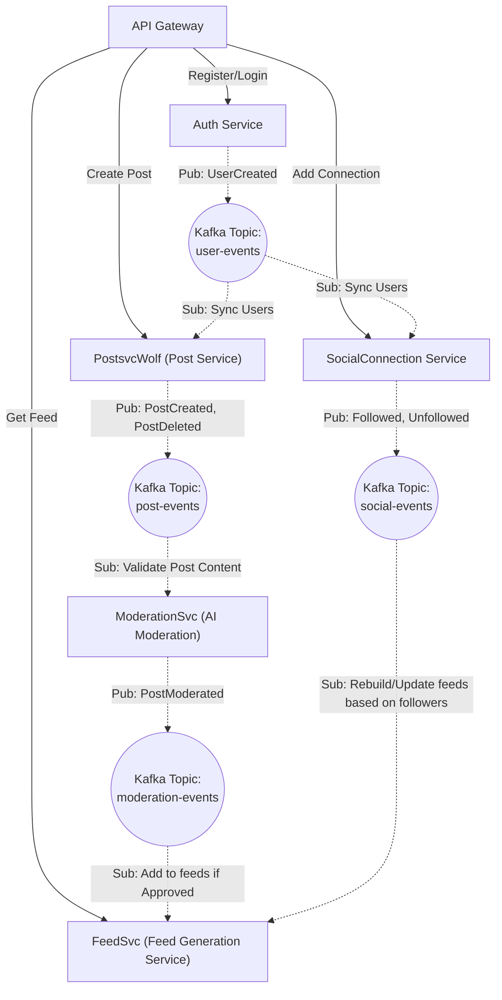

# Microservices Architecture Overview

This diagram represents the proposed event-driven communication structure between the microservices utilizing Apache Kafka.

```mermaid
flowchart TD
    %% Define API Gateway
    AG[API Gateway]
    
    %% Define Microservices
    Auth[Auth Service]
    PostSvc["PostsvcWolf (Post Service)"]
    ModSvc["ModerationSvc (AI Moderation)"]
    Social[SocialConnection Service]
    Feed["FeedSvc (Feed Generation Service)"]
    
    %% Define Kafka Topics
    K_User((Kafka Topic:\nuser-events))
    K_Post((Kafka Topic:\npost-events))
    K_Mod((Kafka Topic:\nmoderation-events))
    K_Social((Kafka Topic:\nsocial-events))
    
    %% Client Requests
    AG -->|Register/Login| Auth
    AG -->|Create Post| PostSvc
    AG -->|Add Connection| Social
    AG -->|Get Feed| Feed

    %% Service to Kafka (Producers)
    Auth -.->|Pub: UserCreated| K_User
    PostSvc -.->|Pub: PostCreated, PostDeleted| K_Post
    ModSvc -.->|Pub: PostModerated| K_Mod
    Social -.->|Pub: Followed, Unfollowed| K_Social

    %% Kafka to Service (Consumers)
    K_User -.->|Sub: Sync Users| Social
    K_User -.->|Sub: Sync Users| PostSvc
    K_Post -.->|Sub: Validate Post Content| ModSvc
    
    %% Feed Generation reads events
    K_Mod -.->|Sub: Add to feeds if Approved| Feed
    K_Social -.->|Sub: Rebuild/Update feeds based on followers| Feed
```
