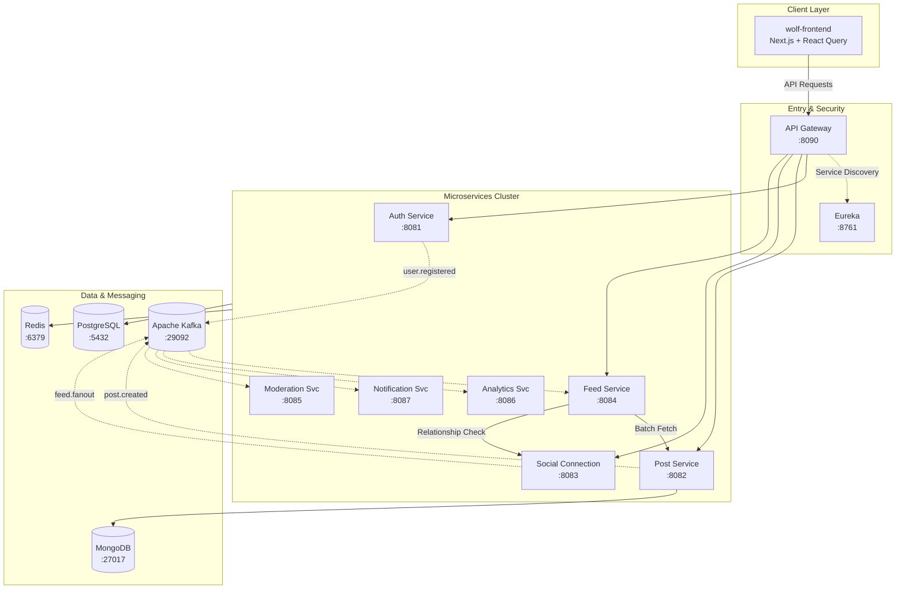

# WolfDire – Enterprise Social Media Microservices

WolfDire is a high-scale, event-driven social media platform built on a distributed microservices architecture. This repository serves as the central infrastructure for the entire ecosystem.

## 🏗️ System Architecture

The following diagram illustrates the "Mega Project" topology as analyzed by **Graphify**, showing the flow from the Next.js frontend through the Spring Cloud Gateway to the specialized microservices and shared infrastructure.

---

## 📊 Graphify Analysis Insights

A deep-graph analysis of the codebase reveals the following scale:

*   **Total Files**: 283
*   **Total Nodes**: 1,158 (Code entities, classes, and methods)
*   **Total Edges**: 1,458 (Dependencies and interactions)
*   **Communities**: 98 distinct logical modules detected.

### Core Hubs ("God Nodes")
The following components represent the central nervous system of the project:
1.  **PostService**: Orchestrates content lifecycle across multiple storage layers.
2.  **KafkaConfig**: Manages the complex event-driven backbone.
3.  **AuthService**: Central security and identity provider.
4.  **ConnectionService**: Manages the social graph and relationship logic.

---

## 🔌 Service Registry & Port Map

| Service | Port | Primary Responsibility |
| :--- | :--- | :--- |
| **API Gateway** | 8090 | Central entry point, CORS, and JWT routing. |
| **Auth Service** | 8081 | Identity, OAuth2, and RBAC management. |
| **Post Service** | 8082 | Content creation, storage, and threaded comments. |
| **Social Connection** | 8083 | User relationships, blocks, and community logic. |
| **Feed Service** | 8084 | Real-time feed generation and ranking. |
| **Moderation Svc** | 8085 | AI-driven content safety (Standby). |
| **Analytics Svc** | 8086 | User engagement and system performance metrics. |
| **Notification Svc** | 8087 | Real-time alerts via WebSockets and Email. |

---

## 🚀 Key Technologies
*   **Backend**: Java 17+, Spring Boot 3.x, Spring Cloud, Spring Security (JWT).
*   **Frontend**: Next.js 14, TailwindCSS, TanStack Query (React Query).
*   **Messaging**: Apache Kafka.
*   **Databases**: PostgreSQL, MongoDB.
*   **Caching**: Redis.
*   **DevOps**: Docker Compose, Eureka.

---

## 🛠️ Getting Started
Ensure you have Docker and Java 17 installed.

1.  **Start Infrastructure**: `docker-compose up -d`
2.  **Run Services**: Each service can be started via `./mvnw spring-boot:run` or through an IDE.
3.  **Frontend**: `cd wolf-frontend && npm run dev`
